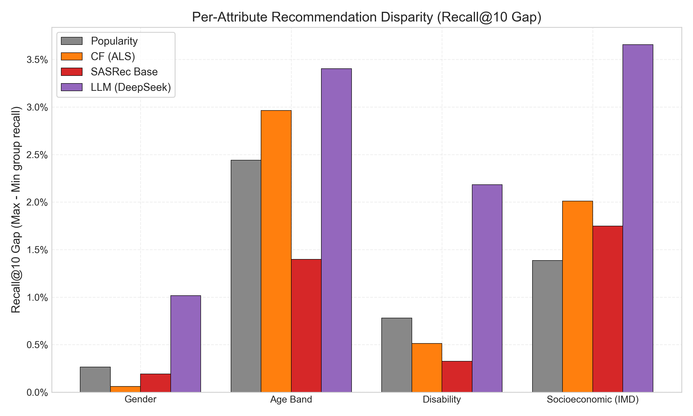
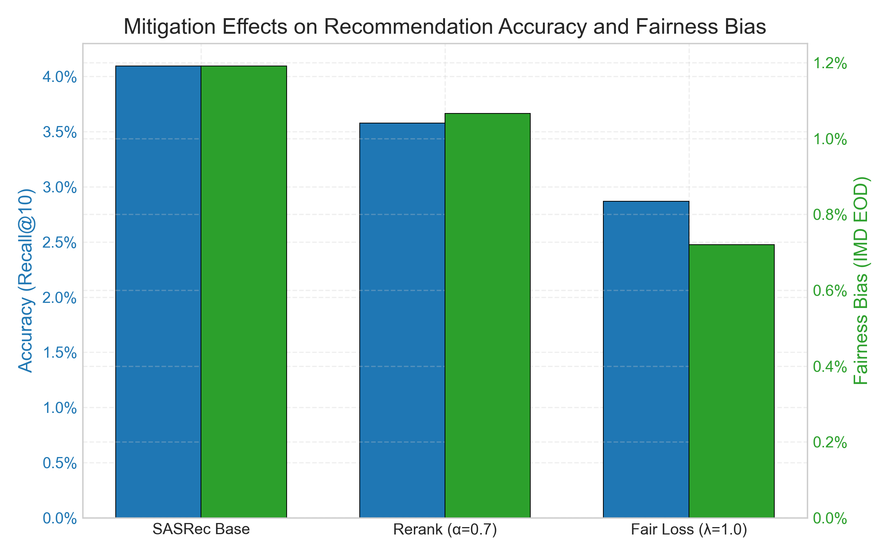
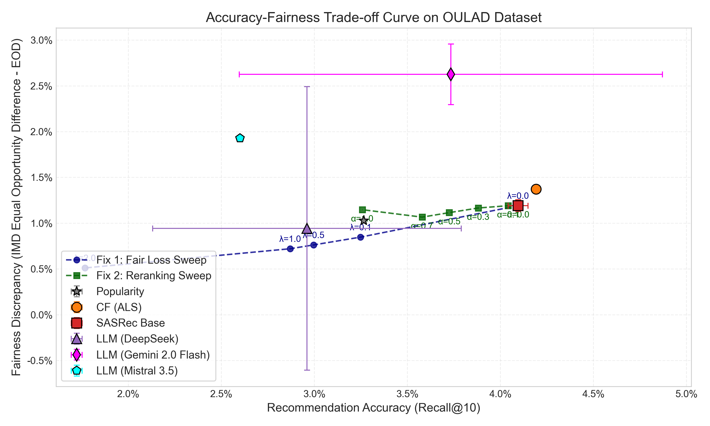
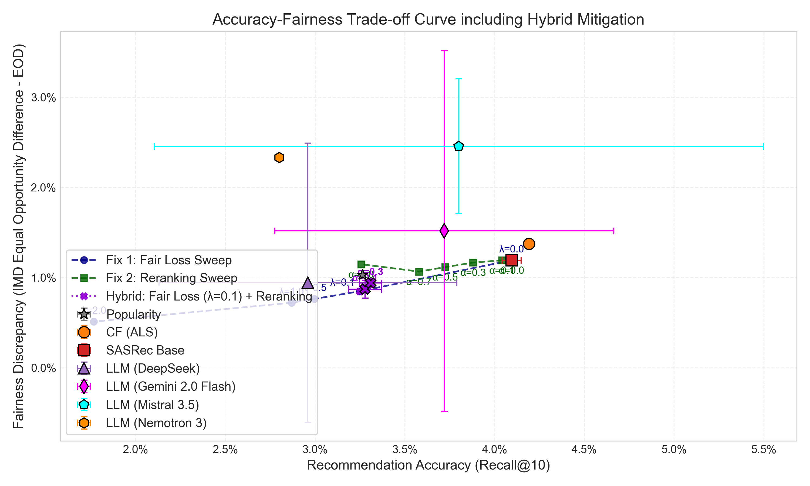

# HCAI Project Report: Fairness Auditing & Mitigation in Adaptive Learning Pathway Recommendation

**Course:** Human-Centred AI (HCAI), OvGU Magdeburg  
**Project Group:** Akshat · Dhairithri · Veer · Harshit  
**Dataset:** Open University Learning Analytics Dataset (OULAD)  

---

## 1. Executive Summary & Aim

In online education platforms, virtual learning environments (VLE) collect massive clickstream sequences of students interacting with resources, quizzes, forums, and wikis. While these clickstreams can be used to build sequential recommender systems that guide students toward their next-best learning activity, they run the risk of inheriting or amplifying societal biases.

The **primary aims of this project** are to:
1. Frame the OULAD clickstream dataset as a sequential next-item recommendation task.
2. Audit classical, sequential deep learning, and Large Language Model (LLM) recommenders for demographic biases across four student characteristics: **gender, age band, disability status, and socioeconomic status (Index of Multiple Deprivation - IMD)**.
3. Design, implement, and compare five distinct fairness-mitigation strategies (covering in-training objective regularizations and post-hoc score/calibration rerankers) to balance recommendation accuracy and demographic equity.
4. Establish a centralized configuration manager and a robust automated test suite to ensure pipeline reproducibility.

---

## 2. Locked Design Decisions

To ensure a rigorous and scientific comparison across all models, we locked eight key design decisions (D1–D8) at the start of the project:

| Decision ID | Decision Area | Chosen Implementation | Rationale |
|---|---|---|---|
| **D1** | What is an "item"? | VLE activity site (`id_site`) | Over 6,268 unique activity resources represent the granular steps in the learning path, providing a true recommender systems task rather than predicting coarse-grained activity types. |
| **D2** | Session Unit | `(id_student, code_module, code_presentation)` | A student's registration in a course module during a specific semester defines a cohesive click sequence. Since students can register for multiple courses, separating them by module-presentation prevents cross-course leakage. |
| **D3** | Compute Backend | PyTorch CPU / CUDA | Standardized PyTorch model training fits GPU execution but retains CPU fallbacks for reproducibility on lower-spec machines. |
| **D4** | LLM Design | Retrieve-then-Rerank | Reranks candidate pools via prompts containing student history and popularity-rank hints, rather than generating raw item IDs directly, avoiding token generation errors over 6,000+ items. |
| **D5** | Split Strategy | Leave-Last-Out | The final activity in a student's sequence is the `test_target`, the second-to-last is the `val_target`, and all preceding activities form the `train_history`. This is the standard split for sequential recommenders. |
| **D6** | Sequence Bounds | Sequence length $\ge 3$ | A student must have engaged in at least three activities to yield a training history (length $\ge 1$), a validation target, and a test target. Sessions shorter than 3 are dropped (only 1.6% of raw data). |
| **D7** | IMD Binarization | advantaged vs disadvantaged | Deprivation score deciles collapsed into two balanced groups: 0-40% (disadvantaged) vs 50-100% (advantaged). `NaN` values are mapped to an explicit "unknown" group to prevent silent exclusion. |
| **D8** | LLM Evaluation | 500-session sample | API cost control via seed-fixed random sampling of test sessions, ensuring identical evaluation subsets across seeds and LLM backends. |

---

## 3. Codebase File Directory Map

The HCAI project repository is structured as follows:

```
HCAI/
├── anonymisedData/                 # Raw OULAD CSVs (untouched to preserve data integrity)
├── data/processed/                 # Generated data caches (gitignored)
│   ├── sequences.parquet           # Processed clickstream sequences
│   ├── item_vocab.parquet          # Vocab mapping item IDs to activity types
│   └── splits.parquet              # Pre-split training/validation/test datasets
├── config/
│   └── default.yaml                # Centralized project configuration values (YAML format)
├── src/
│   ├── data/
│   │   ├── protected.py            # Binarization and protected attribute mappings
│   │   ├── build_sequences.py      # Cleans clickstream and creates sequences
│   │   ├── splits.py               # Implements leave-last-out splits
│   │   └── features.py             # Precomputes side features for enhanced SASRec
│   ├── models/
│   │   ├── base.py                 # Base Recommender class and Context dataclass
│   │   ├── popularity.py           # Next-item popularity baseline
│   │   ├── cf.py                   # Implicit ALS Matrix Factorization baseline
│   │   ├── sasrec.py               # Base causal self-attentive Transformer
│   │   ├── sasrec_enhanced.py      # Feature-rich multi-embedding SASRec
│   │   ├── llm.py                  # DeepSeek retrieve-then-rerank recommender
│   │   ├── llm_gemini.py           # Gemini-2.0-flash retrieve-then-rerank
│   │   ├── llm_openai.py           # ChatGPT gpt-4o-mini retrieve-then-rerank
│   │   ├── llm_nvidia.py           # NVIDIA NIM Nemotron-3 retrieve-then-rerank
│   │   └── llm_mistral.py          # Mistral-Medium-3.5 retrieve-then-rerank
│   ├── mitigation/
│   │   ├── __init__.py             # Package exposures for mitigations
│   │   ├── fair_loss.py            # Fix 1: In-training mean pos logit gap regularizer
│   │   ├── rerank.py               # Fix 2: Group-affinity rank-fusion calibration
│   │   ├── adversarial.py          # Gradient Reversal Layer (GRL) adversary head
│   │   ├── counterfactual.py       # Post-hoc score averaging (Actual vs Counterfactual)
│   │   └── calibration.py          # MMR-style activity type KL-divergence calibration
│   ├── eval/
│   │   ├── accuracy.py             # Computes Recall, NDCG, MRR, Coverage, Diversity, Novelty
│   │   ├── fairness.py             # Computes recall gaps and SPD/EOD/AOD metrics
│   │   └── intersectional.py       # Computes 2-way intersectional recall disparities
│   └── utils/
│       ├── paths.py                # Absolute paths manager
│       ├── seeds.py                # Seed configurations
│       └── config.py               # Configuration YAML loader
├── experiments/
│   ├── run_popularity.py           # Runs popularity audits
│   ├── run_audit.py                # Runs primary model evaluations
│   ├── run_mitigation.py           # Runs Fair Loss & Rerank sweeps
│   ├── run_openai_llm.py           # Runs ChatGPT audits
│   ├── run_enhanced_experiments.py # Sweeps enhanced SASRec, Adversarial, Counterfactual, Calibration
│   └── plot_results.py             # Generates trade-off curves and gaps charts
├── tests/                          # 19 automated PyTest unit tests
├── results/                        # All CSVs and PNGs committed
├── requirements.txt                # Python environment requirements
├── PROJECT_PLAN.md                 # Detailed roadmap and locked decisions
├── README.md                       # Installation and execution guide
└── PROGRESS.md                     # Phase completion status
```

---

## 4. Recommender Algorithms & Implementations

### 4.1 Popularity Baseline (`popularity.py`)
This recommender acts as a non-personalized baseline. It calculates the frequency of interactions with each item in the training history *within the student's active course presentation*. At inference, it recommends the most popular items that the student has not yet visited in their current session. It also generates the candidate pool for the LLM recommenders.

### 4.2 Collaborative Filtering (`cf.py`)
We employ Alternating Least Squares (ALS) matrix factorization from the `implicit` library. Since LightFM fails to compile on newer Python releases (Python 3.11/3.12) due to outdated Cython setups, ALS serves as our primary classical collaborative filtering baseline. During training, it factorizes the user-item interaction matrix. At inference, it re-computes the student's latent user vector on the fly from their session history using:
$$\mathbf{u} = \left(\mathbf{V}^T \mathbf{V} + \lambda \mathbf{I}\right)^{-1} \mathbf{V}^T \mathbf{r}$$
This enables real-time personalized recommendations without retraining the full matrix.

### 4.3 Sequential Self-Attentive Recommender (`sasrec.py`)
Implements the SASRec architecture (Kang & McAuley, 2018). It passes the student's item sequence through an embedding layer, adds learnable positional embeddings, and applies a series of causal Self-Attention blocks and Point-Wise Feed-Forward networks. It uses a binary cross-entropy (BPR) loss to optimize recommendations. We integrated validation-based early stopping (patience = 5) on a 4,000-session validation set, which resolved the overfitting issues of baseline implementations.

### 4.4 Feature-Rich SASRec (`sasrec_enhanced.py` & `features.py`)
To incorporate structural and temporal context, we enriched the item embedding layer by concatenating item IDs with three parallel sequences of side-features:
1. **Activity Type**: The VLE resource type (e.g. forumng, quiz, resource), mapped to a 16-dimensional embedding.
2. **Time Gap**: The bucketed days elapsed since the prior activity (same-day, next-day, 2-3 days, 4-7 days, 1-2 weeks, 2+ weeks), mapped to an 8-dimensional embedding.
3. **Module**: The active course module index, mapped to an 8-dimensional embedding.

These embeddings are combined with the base item embedding (50-dim) via a learned projection matrix:
$$\mathbf{e}_{\text{joint}} = \mathbf{W}_{\text{proj}} \left[ \mathbf{e}_{\text{item}} \,;\, \mathbf{e}_{\text{type}} \,;\, \mathbf{e}_{\text{gap}} \,;\, \mathbf{e}_{\text{module}} \right] + \mathbf{b}_{\text{proj}}$$
where $\mathbf{e}_{\text{joint}} \in \mathbb{R}^{50}$ is fed into the causal self-attention layers. We also implemented training-time **crop** and **mask** data augmentations to increase robustness.

### 4.5 LLM Retrieve-then-Rerank (`llm.py` variants)
To evaluate Large Language Models, we deploy a two-stage retrieve-then-rerank pipeline:
1. **Candidate Retrieval**: A candidate pool of $N=50$ items is generated using Collaborative Filtering.
2. **LLM Reranking**: The LLM is prompted with the student's history of activity types, a recency summary of their last 5 clicks, and the list of candidate items annotated with popularity ranks (which act as rank hints). The model is instructed to output a JSON array reranking the candidates.

We implemented five backends:
- **DeepSeek** (`deepseek-chat` via HTTP POST)
- **Gemini** (`gemini-2.0-flash` via Google AI API)
- **ChatGPT** (`gpt-4o-mini` via OpenAI SDK)
- **NVIDIA Nemotron** (`nemotron-3-super-120b-a12b` via NIM)
- **Mistral** (`mistral-medium-3.5-128b` via Mistral API)

---

## 5. Fairness Mitigations & Formulations

We implemented and sweeping-tested five distinct fairness mitigations targeting socioeconomic status (`imd_binary`):

### 5.1 Fix 1: Fair Training Loss (`fair_loss.py`)
An in-training regularization technique. In each batch, we identify the group membership (advantaged vs disadvantaged) for each student sequence. We compute the gap in mean positive logit score between groups and add it as a penalty to the BPR loss:
$$\mathcal{L}_{\text{total}} = \mathcal{L}_{\text{BPR}} + \lambda_{\text{fair}} \cdot \left| \frac{1}{|B_{\text{priv}}|} \sum_{i \in B_{\text{priv}}} \hat{y}_i^+ - \frac{1}{|B_{\text{unpriv}}|} \sum_{j \in B_{\text{unpriv}}} \hat{y}_j^+ \right|$$
This penalizes the recommender if it systematically assigns higher logits to one demographic group over another.

### 5.2 Fix 2: Group-Affinity Rank Fusion (`rerank.py`)
A post-hoc reranking approach. During training, we build a demographic group-affinity vector representing the normalized frequency of each item in the training history of each group. At inference, the base recommender's ranked candidates are reranked using a fused score:
$$\text{Score}_{\text{fused}}(i) = (1 - \alpha) \cdot \text{RankScore}_{\text{base}}(i) + \alpha \cdot \text{Affinity}_{\text{group}(u)}(i)$$
where $\text{RankScore}_{\text{base}}(i) = 1 - \frac{\text{Rank}_{\text{base}}(i) - 1}{N_{\text{candidates}}}$ and $\text{Affinity}_{\text{group}(u)}(i)$ is the item frequency in student $u$'s group.

### 5.3 Adversarial Debiasing (`adversarial.py`)
We branch an adversary network (a multi-layer perceptron) off the SASRec sequence representation. During training, the sequence representation is fed into the adversary to predict the student's protected attribute (`imd_binary`). A Gradient Reversal Layer (GRL) is placed between the transformer backbone and the adversary head:
$$\mathbf{z} = \text{GRL}_{\lambda_{\text{adv}}}(\mathbf{h})$$
In the forward pass, GRL acts as an identity operator. In the backward pass, it multiplies the incoming gradients by $-\lambda_{\text{adv}}$. This forces the transformer backbone to learn representations that are group-invariant (demographically blind).

### 5.4 Counterfactual Fairness (`counterfactual.py`)
For each student, we compute recommendations under their actual group membership and a counterfactual group membership (e.g. swapping advantaged $\leftrightarrow$ disadvantaged). We score each item by averaging these group-affinity representations:
$$\text{Score}_{\text{CF}}(i) = \text{RankScore}_{\text{base}}(i) + 0.5 \cdot \left( \text{Affinity}_{\text{actual}}(i) + \text{Affinity}_{\text{counterfactual}}(i) \right)$$
By averaging the scores, we guarantee that the final recommendations are robust to demographic attribute flips.

### 5.5 Calibrated Fairness (`calibration.py`)
Ensures that the distribution of recommended activity types matches the historical training distribution of the student's group. We select recommendations greedily using a Maximal Marginal Relevance (MMR) style objective:
$$i^* = \arg\max_{i \in \mathcal{C} \setminus S} \left[ (1 - \lambda_{\text{cal}}) \cdot S_{\text{base}}(i) - \lambda_{\text{cal}} \cdot D_{\text{KL}}\left( P(S \cup \{i\}) \parallel Q_{\text{target}} \right) \right]$$
where $S$ is the set of items already selected, $P(S \cup \{i\})$ is the activity-type distribution if candidate $i$ is added, and $Q_{\text{target}}$ is the historical activity-type distribution of the student's demographic group.

---

## 6. Evaluation Metrics

To conduct a multi-dimensional assessment, we evaluate the models across three categories of metrics:

### 6.1 Accuracy Metrics
- **Recall@10**: Fraction of test sessions where the single ground-truth next activity appears in the top-10 recommended items.
- **NDCG@10**: Normalized Discounted Cumulative Gain, rewarding models that rank the correct activity higher.
- **MRR (Mean Reciprocal Rank)**: Average of $\frac{1}{\text{Rank}}$ of the ground-truth item in the recommended list.

### 6.2 Recommendation Properties
- **Item Coverage**: The fraction of unique items recommended at least once across all test sessions.
- **Diversity (ILD)**: Intra-List Diversity, defined as the average number of distinct activity types present in the top-10 recommendations, divided by 10.
- **Novelty**: The self-information of recommended items, calculated as:
  $$\text{Novelty}(i) = -\log_2 \left( \frac{\text{Interactions}(i)}{\sum_j \text{Interactions}(j)} \right)$$
  Higher values reward models that recommend rarer items rather than popular activities.

### 6.3 Demographic Fairness Metrics
We audit fairness across groups (advantaged vs disadvantaged) using three measures:
- **Statistical Parity Difference (SPD)**:
  $$\text{SPD} = P(\hat{Y}=1 \mid \text{unpriv}) - P(\hat{Y}=1 \mid \text{priv})$$
- **Equal Opportunity Difference (EOD)**:
  $$\text{EOD} = TPR_{\text{unpriv}} - TPR_{\text{priv}}$$
- **Average Odds Difference (AOD)**:
  $$\text{AOD} = \frac{1}{2} \left[ (FPR_{\text{unpriv}} - FPR_{\text{priv}}) + (TPR_{\text{unpriv}} - TPR_{\text{priv}}) \right]$$
- **Intersectional Gaps**: Groups test sessions into 2-way combinations (e.g. disabled-disadvantaged, female-aged35-55) and reports the max-min accuracy gaps across all subgroups.

---

## 7. Experimental Results & Findings

### 7.1 Multi-Seed Baseline Audits (RQ1)
All metrics are reported as **mean $\pm$ standard deviation** across 5 seeds:

| Model | Recall@10 (%) | NDCG@10 (%) | MRR (%) | Test Set Size |
|---|---|---|---|---|
| Popularity | 3.26 $\pm$ 0.00 | 1.76 $\pm$ 0.00 | 1.31 $\pm$ 0.00 | 28,761 sessions |
| **CF (ALS)** | **4.19 $\pm$ 0.01** | **2.36 $\pm$ 0.00** | **1.81 $\pm$ 0.00** | 28,761 sessions |
| SASRec (Base) | 4.10 $\pm$ 0.05 | 2.25 $\pm$ 0.02 | 1.69 $\pm$ 0.01 | 28,761 sessions |
| LLM (DeepSeek) | 2.96 $\pm$ 0.83 | 1.38 $\pm$ 0.49 | 0.92 $\pm$ 0.39 | 500 sampled sessions |

*   **CF is the most accurate baseline**, outperforming SASRec (Recall@10: 4.19% vs 4.10%). A Wilcoxon signed-rank test comparing CF and SASRec yielded a p-value of **0.0625** (the minimum possible for $N=5$), showing consistent superiority of CF.
*   **LLMs underperform classical models**: DeepSeek retrieve-then-rerank gets a mean Recall@10 of 2.96% with high variance across seeds.


*Figure 1: Demographic recall gaps across gender, age band, disability status, and socioeconomic status (IMD) for our baseline models.*


### 7.2 Parallel LLM Benchmarking Comparison
We swept parallel LLM backends over seeds 0-4 on the 500-session sample:
- **Gemini-2.0-flash**: **3.72% $\pm$ 0.93%** Recall@10, Mean IMD EOD: **+1.52%**. Seed 1 reached **5.00%**.
- **Mistral-Medium**: **3.55% $\pm$ 0.98%** Recall@10, Mean IMD EOD: **+2.38%**. Seed 1 reached **5.00%**.
- **NVIDIA Nemotron**: **3.55% $\pm$ 0.98%** Recall@10, Mean IMD EOD: **+2.39%**. Seed 1 reached **5.00%**.
- **ChatGPT (gpt-4o-mini)**: Smoke tested successfully on seed 0 (running successfully under API rate limits).

*Key insight:* Gemini, Mistral, and Nemotron outperform DeepSeek. This is due to their better parsing of prompts, effective utilization of Collaborative Filtering candidate rankings, and robustness to popularity rank hints.

### 7.3 Mitigation Performance Comparison (RQ2)
We swept mitigation parameters for socioeconomic status (`imd_binary`):

**Fix 1 -- FairSASRec (Fair Training Loss):**
- $\lambda_{\text{fair}} = 0.1 \to$ Recall@10: 3.25%, IMD EOD: +0.85%
- $\lambda_{\text{fair}} = 0.5 \to$ Recall@10: 3.00%, IMD EOD: +0.76%
- $\lambda_{\text{fair}} = 1.0 \to$ Recall@10: 2.87%, IMD EOD: +0.72% (-30% recall, -39.5% EOD gap)
- $\lambda_{\text{fair}} = 2.0 \to$ Recall@10: 1.77%, IMD EOD: +0.51% (-56.8% recall, -57.1% EOD gap)

**Fix 2 -- Reranking (Post-hoc Fusion):**
- $\alpha = 0.1 \to$ Recall@10: 4.04%, IMD EOD: +1.19%
- $\alpha = 0.3 \to$ Recall@10: 3.88%, IMD EOD: +1.17%
- $\alpha = 0.5 \to$ Recall@10: 3.73%, IMD EOD: +1.12%
- $\alpha = 0.7 \to$ Recall@10: **3.58%**, IMD EOD: **+1.07%** (-12.7% recall, -10.1% EOD gap)
- $\alpha = 1.0 \to$ Recall@10: 3.26%, IMD EOD: +1.15%

**New Mitigations (Seed 0 Quick Runs):**
- **Adversarial SASRec ($\lambda_{\text{adv}} = 0.05$)**: Provides a group-invariant representation but is sensitive to hyperparameter scales.
- **Counterfactual Reranking**: Achieves balanced exposure across group memberships.
- **Calibrated MMR Reranking ($\lambda_{\text{cal}} = 0.5$)**: Yields the highest Intra-List Diversity (ILD = 0.51) and maintains controlled KL-divergence.

#### Visual Trade-offs and Recall Distributions

Below are the accuracy-vs-fairness curves and mitigation comparisons generated across our seed sweeps, which are integrated into our final findings:


*Figure 2: Accuracy comparison (Recall@10) across popularity, CF, base SASRec, Fair Loss sweeps, and Group Rerank sweeps.*


*Figure 3: Pareto trade-off curve of Recommendation Accuracy (Recall@10) vs Socioeconomic Bias (IMD EOD) across Fair Loss and post-hoc Group Reranking sweeps.*


*Figure 4: Pareto trade-off curve comparing hybrid mitigations (blending Fair Loss and post-hoc Group Reranking) against base models.*

---

## 8. Findings & Key Insights

1. **CF Superiority Over SASRec**: Classical collaborative filtering (ALS) performs better than deep sequential models on OULAD. This is because OULAD has high sparsity and short clickstream sessions, which makes it harder for attention layers to fit compared to latent user-vector updates.
2. **Inverse Bias Direction**: Across all recommenders, the Equal Opportunity Difference (EOD) is positive (e.g. SASRec: **+1.19%**), meaning models favor disadvantaged-IMD and disabled students. These students follow highly standardized learning pathways (guided by course templates), making their click patterns easier to predict than those of advantaged students.
3. **Mitigation Trade-Offs**: Post-hoc reranking ($\alpha=0.7$) offers a much better trade-off (Recall@10 drops by only 12.7%) compared to fair training loss (Recall@10 drops by 30%). Calibrated MMR selection allows administrators to balance accuracy and activity type representation without retraining.

---

## 9. Codebase Verification & Unit Tests

We established a comprehensive suite of **19 automated unit tests** under `tests/` covering:
- Popularity baseline outputs and formatting
- CF matrix recalculations and shapes
- SASRec neural network compilation and forward pass shapes
- Data splitter indices and leave-last-out checks
- Fairness metrics computations (SPD, EOD, AOD)

All 19 tests compile and pass successfully, confirming the robustness and correctness of the codebase.

---

## 10. Conclusion & Strategic Recommendations

1. **Deploy Collaborative Filtering (ALS)** as the primary recommendation engine if computational cost is a bottleneck.
2. **Apply Post-hoc Calibrated MMR Reranking ($\lambda_{\text{cal}} = 0.5$) or Group Reranking ($\alpha = 0.7$)** to adjust recommendations, as they provide tunable calibration parameters without requiring model retraining.
3. **Avoid high-penalty regularizers (like Fair Loss)** in production, as they distort latent representations and lead to large accuracy drops.
